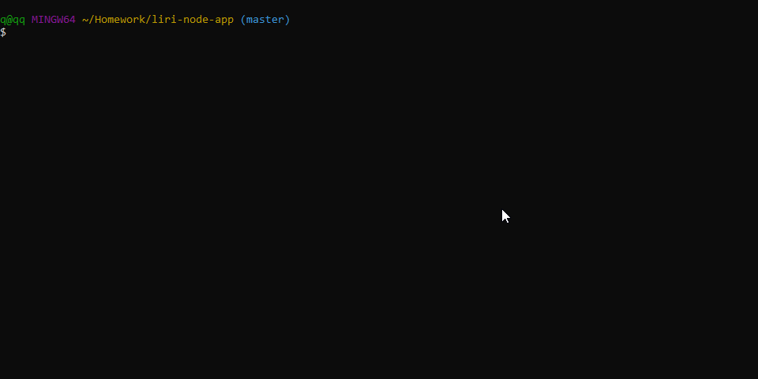

# LIRI Node Application

A Node.js CLI app created during UCF's Web Development Bootcamp. Mimicking Apple's SIRI (Speech Interpretation and Recognition Interface), LIRI can recognize language inputted by users on the command line.

## Getting Started

Download or clone the repository [here](https://github.com/onieronaut/liri-node-app)

### Prerequisites

[Node.js](https://nodejs.org/en/)

### Installing

After downloading the repository and installing Node.js, use your command line interface to navigate to the directory the repository is located in and install the requried packages.

    npm install

### APIs

This appilcation makes requests to 3 different APIs, API keys are provided for BandsInTown and OMDB, but you need to sign up for your own Spotify key [here](https://developer.spotify.com/dashboard/login). Use the Dotenv package to store your API key and Secret in an untracked file that is then referenced in keys.js.

## How To Use

Basic syntax on the command line is as follows:

    node liri.js command input

This application takes in a command and input from the command line using the process.argv array, performs a function, and then logs the results to the user.

### Commands

The 4 commands, followed by their required inputs are:
* `concert-this <artist/band name>` 
This command calls a function which makes a request to the BandsInTown API. It will search for the band provided by the user and then log their tour dates, the city they are performing in, and the name of the venue.

* `spotify-this-song <song name>` 
This command calls a function which makes a reqest to the Spotify API. It will search for the song name provided by the user and then log the name of the artist, the song's name, a preview link to the Spotify website, and the album that the song is on.

* `movie-this <movie name>` 
This command calls a function which makes a request to the OMDB API. It will search for the movie name provided by the user and then log the name of the movie, the year it was released, the IMDB and Rottent Tomatoes ratings, the country it was produced in, the language, plot, and actors in the movie.

* `do-what-it-says` 
This command will read from a file called random.txt that has one of the three previously mentioned commands, followed by an input, and then perform the corresponding function.

All of these commands also print the same results the user sees to log.txt.

## Built With

* Javascript
* [Moment.js](https://momentjs.com/)
* [Axios](https://www.npmjs.com/package/axios)
* [Node-Spotify-API](https://www.npmjs.com/package/node-spotify-api)
* [Dotenv](https://www.npmjs.com/package/dotenv)

## Program Flow

Here is a representation of the logical flow of the program.

## Author

* Jerard Gonzalez - [GitHub](https://github.com/onieronaut)